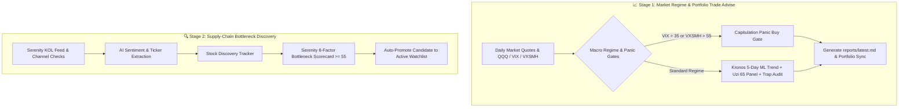

# 🌿 Touchgrass Skill (`touchgrass`)

**Touchgrass Trader** is an agentic swing trading decision-support and bottleneck discovery system designed for humans who'd rather touch grass than stare at intraday candle charts.

It strictly promotes a **disciplined Swing Trading strategy (5 to 20 days holding period)** across high-conviction companies, eliminating emotional trading, FOMO, and scam traps.

---

## ⚙️ System Process Architecture

The `touchgrass` workflow operates via two integrated sub-workflows:

---

## 📋 Execution Workflows

### Stage 1: Market Regime & 360 Swing Analysis (`python main.py run`)
1. **Macro Market Gates**:
   - Analyzes QQQ, VIX, and `^VXSMH` (Semiconductor Volatility Index).
   - **Capitulation Gate**: Triggers panic accumulation directives if `^VIX > 35` or `^VXSMH > 55`.
   - **Trend Gate**: Checks QQQ 200 SMA alignment to confirm macro bull/bear bias.
2. **360-Degree Stock Scoring**:
   - **Kronos 5-Day Trend Prediction**: Runs financial time-series model to project 5-day directional K-line momentum.
   - **Uzi 65-Investor Panel**: Evaluates ticker across 7 major factions (Value, Growth, Macro, Technical, Quant, China Value, A-Share Youzi).
   - **Uzi Trap Security**: Audits penny stocks (<$1.00), micro-caps (<$50M), zero volume illiquidity, and pump-and-dump group recommendations.
3. **Portfolio & Watchlist Sync**: Updates `reports/latest.md` and syncs trailing stop-loss / take-profit levels.

### Stage 2: Stock Discovery & Bottleneck Exploration (`python main.py scan`)
1. **Supply-Chain Monopoly Identification**: Scrapes and parses channel checks for monopolistic leaders (e.g., NVDA, AVGO, TSM, ASML).
2. **Serenity Scorecard Evaluation**: Evaluates discovered candidates against the 8-factor Serenity bottleneck criteria.
3. **Auto-Promotion**: Discovered tickers with Serenity Score **>= 55/100** are automatically added to the active swing watchlist.

---

## 📝 Executive Summary Synthesis (The 3 Core Questions)

When executing `touchgrass` analysis, synthesize output into the standard 3-question executive summary:

1. **Q1: How is the US stock market? Is it bullish? Should I trade (buy/sell)?**
   - Detail QQQ trend vs 200 SMA, VIX volatility level, Semiconductor fear index (`^VXSMH`), and active swing buy/sell directives.
2. **Q2: What key supply-chain insights and lessons were observed recently?**
   - Summarize recent Serenity channel checks, extracted tickers, pricing power observations, and bottleneck dynamics.
3. **Q3: Which discovered stocks should be promoted or pruned from the active watchlist?**
   - Detail new candidates promoted to active watchlist (Serenity Score >= 55) and recommendations for pruning low-conviction tickers.

---

## 🛠️ CLI Quick Reference

| Command | Action |
| :--- | :--- |
| `python main.py run` | Run full market round (Macro regime, Kronos ML, Uzi Panel, Report generation) |
| `python main.py run --type morning` | Execute 11:30 AM ET market open check |
| `python main.py run --type afternoon` | Execute 3:30 PM ET pre-close market check |
| `python main.py scan --max 5` | Auto-discover supply-chain bottleneck candidates |
| `python main.py analyze <SYMBOL>` | Run 360-degree evaluation on specific stock (e.g. `NVDA`) |
| `python main.py watchlist` | View active swing watchlist and current portfolio holdings |
| `python main.py add <SYMBOL> --target <PRICE> --notes "<REASON>"` | Add new stock to active swing watchlist |
| `python main.py remove <SYMBOL>` | Remove stock symbol from active watchlist |
| `python main.py hold <SYMBOL> --shares <N> --price 
` | Log or update portfolio holding position |
