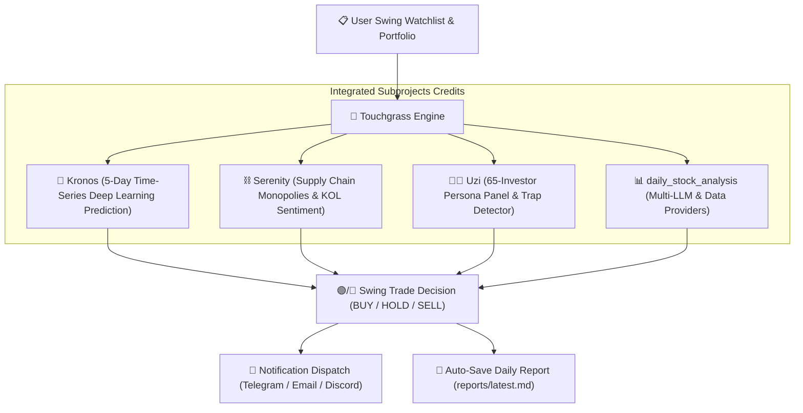

<div align="center">


# 🌿 Touchgrass Trader (`touchgrass`)

**Chill stock management for humans who'd rather touch grass than stare at candle charts all day.**

[](LICENSE)
[-emerald.svg)](#-swing-trading-philosophy)
[](https://www.python.org/downloads/)
[](.github/workflows/touchgrass_market_run.yml)
[](AGENTS.md)

---

</div>

## 📖 What Does "Touch Grass" Mean? (The Story & Philosophy)

In internet culture, **"Touch Grass"** is a friendly reminder to turn off your glowing screens, step outside, feel the fresh air, and reconnect with real life.

In the stock market, staring at 5-minute candle charts all day is a fast track to stress, FOMO, panic selling, and losing money. Most non-professional investors don't fail because they lack intelligence—they fail because they spend **too much time** obsessing over intraday noise and falling for social media hype groups.

**Touchgrass Trader** was created to change that forever:

> 🌿 **"Go touch grass, let AI manage your stock portfolio with institutional discipline."**

Touchgrass runs automatically twice a day—once at 11:30 AM ET (morning check 2 hours after open) and once at 3:30 PM ET (late-afternoon check 30 minutes before market close so you can place trades before the bell). It evaluates market risk, scores stocks using a 7-faction multi-investor panel, and generates clear, stress-free buy/sell/hold directives directly in markdown market reports.

---

## 📈 Swing Trading Philosophy: Not Intra-Day Noise

**Touchgrass Trader strictly promotes a Swing Trading Strategy (5 to 20 days holding period).**

It is **NOT** a high-frequency day-trading bot. Most retail traders lose capital trying to time 5-minute candle spikes or reacting emotionally to intraday noise.

Instead, Touchgrass:
* **Identifies Multi-Day Swings**: Focuses on high-conviction structural trends, supply-chain monopolies, and institutional accumulation.
* **Runs Twice a Day During Open Market Hours**:
  - **11:30 AM ET (Morning Check)**: Evaluates early market sentiment & trend confirmation 2 hours after US market open.
  - **3:30 PM ET (Late-Afternoon Check)**: Analyzes near-close daily K-lines 30 minutes before US market close so you can act on trade signals before the bell.
* **Enforces Risk Discipline**: Sets 8% trailing stop-loss bounds and 20% swing take-profit targets to eliminate emotional over-trading.

---

## ✨ Key Features

* 🤖 **AI Agent Native (`/touchgrass`)**: Built to integrate natively into **Google Antigravity**, **Claude Desktop**, **Codex**, and **Cursor**. Ask your agent to run analysis, scan for breakouts, or update your portfolio.
* ⏰ **Automated Twice-Daily Market Check**: GitHub Actions workflow runs every trading day (11:30 AM ET & 3:30 PM ET) with manual on-demand execution.
* 🔍 **Auto Stock Selection & US Scanner**: Discovers supply chain bottleneck monopolies (like NVDA, TSM, AVGO, ASML) and high-conviction swing trade setups.
* 🛡️ **Programmatic Liquidity & Penny Stock Risk Audit**: Audits stocks against micro-cap illiquidity (<$50M cap), zero volume, penny stock status (<$1.00), and extreme volatility spikes. *(Social media promoter scam web scraping tracked via [#5](https://github.com/tianchengc/touchgrass/issues/5))*
* 👨‍💼 **7-Faction Multi-Investor Persona Panel**: Evaluates every stock across 7 investment factions: Buffett value, Wood growth, Dalio macro, Minervini momentum, Simons quant, Hillhouse China value, and A-Share Youzi trend. *(Full 65-individual LLM persona simulation tracked via [#4](https://github.com/tianchengc/touchgrass/issues/4))*
* 📱 **Terminal & Multi-Channel Market Digest**: Generates clean, stress-free markdown alerts for console output and local files. *(Remote Discord & Email alert webhook integration tracked via [#2](https://github.com/tianchengc/touchgrass/issues/2))*

---

## ⚡ Quick Start

### Option 1: GitHub Actions (Recommended ⭐)

> **5 minutes setup, 100% free, zero maintenance, no server required.**

#### 1. Fork this Repository
Click the **Fork** button at the top right of this page to create your personal copy (or create a **Private Fork** to keep your portfolio holdings private).

#### 2. Configure Repository Secrets
Go to your repository: `Settings` ➔ `Secrets and variables` ➔ `Actions` ➔ `New repository secret`.

**AI Model API Keys (Configure at least one)**

| Secret Name | Description | Required |
|-------------|-------------|:--------:|
| `GEMINI_API_KEY` | Google Gemini API Key | **Recommended** |
| `ANTHROPIC_API_KEY` | Anthropic Claude API Key | Optional |
| `OPENAI_API_KEY` | OpenAI API Key (or DeepSeek / Qwen API) | Optional |

**Notification Channels (Configure at least one)**

| Secret Name | Description |
|-------------|-------------|
| `TELEGRAM_BOT_TOKEN` + `TELEGRAM_CHAT_ID` | Telegram Bot Notifications |
| `DISCORD_WEBHOOK_URL` | Discord Webhook Notifications |
| `SERVERCHAN_SENDKEY` | ServerChan Push Notifications |
| `SENDER_EMAIL` + `SENDER_PASSWORD` + `RECEIVER_EMAIL` | Email Notifications |

#### 3. Enable GitHub Actions Workflow Permissions (Required for Auto-Commit 🔑)
To allow Touchgrass to automatically save daily reports (`reports/*.md`) and update watchlist states back to your repository:

1. Go to repository **`Settings`** ➔ **`Actions`** ➔ **`General`**.
2. Scroll down to **`Workflow permissions`**.
3. Select **`Read and write permissions`**.
4. Check **`Allow GitHub Actions to create and approve pull requests`**.
5. Click **`Save`**.

> ⚠️ **Note**: If Workflow Permissions are left on *"Read repository contents permission"*, the daily report auto-commit step will fail with a `403 Forbidden` permission error.

#### 4. Validate & Run GitHub Actions
1. Go to the **Actions** tab in your repository.
2. Enable workflows by clicking **"I understand my workflows, go ahead and enable them"**.
3. Select **🌿 Touchgrass Market Runner** from the left sidebar.
4. Click **Run workflow** ➔ Select `manual` ➔ Click **Run workflow**.
5. Check execution logs to verify market analysis and daily report creation in `reports/`!

---

### Option 2: Local CLI Setup

```bash
# Clone the repository
git clone https://github.com/tianchengc/touchgrass.git
cd touchgrass

# Install dependencies
pip install -r requirements.txt
pip install -e .

# Run full market evaluation & portfolio update
python main.py run
```

---

## 📋 Managing Your Watchlist & Portfolio Holdings

Touchgrass tracks two lists inside `config/watchlist.json`:
1. **Watchlist (`"watchlist"`)**: Candidate stocks you are monitoring (with target entry, stop loss, and take profit bounds).
2. **Portfolio Holdings (`"portfolio"`)**: Active stocks you currently own (with share count and average purchase price).

> 🔒 **Privacy Note**: `config/watchlist.json` is automatically ignored in `.gitignore` so your personal holdings and private stock list are never committed to public git history. When running for the first time, Touchgrass automatically copies the fallback template from [config/watchlist.example.json](file:///Users/tiancheng/Documents/Hackathon/stock-invest-tracker/touchgrass/config/watchlist.example.json) to set up your environment out of the box.

### Method A: Via Command Line (CLI)

```bash
# 1. View current watchlist and active portfolio holdings
python main.py watchlist

# 2. Add or update an active stock holding in your portfolio
python main.py hold NVDA --shares 50 --price 118.50

# 3. Add a stock symbol to your watchlist to monitor
python main.py add AAPL --target 210.00 --notes "Apple Intelligence rollout"

# 4. Remove a stock from your watchlist
python main.py remove AAPL
```

### Method B: Via AI Agent Prompt
You can simply tell your AI Agent (in **Google Antigravity**, **Claude Desktop**, **Codex**, or **Cursor**):
* *"Hey, add 50 shares of NVDA at $118.50 to my Touchgrass portfolio holdings."*
* *"Add TSLA to my watchlist with a $220 target price."*
* *"Show my current Touchgrass portfolio."*

### Method C: Direct JSON File Editing
You can directly edit [config/watchlist.json](file:///Users/tiancheng/Documents/Hackathon/stock-invest-tracker/touchgrass/config/watchlist.json):
```json
{
  "watchlist": [
    { "symbol": "NVDA", "target_entry": 115.0, "notes": "AI GPU Leader" }
  ],
  "portfolio": [
    { "symbol": "NVDA", "shares": 50, "avg_price": 118.5, "entry_date": "2026-08-07" }
  ]
}
```

```bash
# Discover swing trading candidates (Supply chain monopolies & KOL scorecards)
python main.py scan --max 5

# Perform 360-degree swing analysis on a stock ticker
python main.py analyze NVDA

# View current watchlist and holdings
python main.py watchlist
```

---

## 🤖 Using with AI Agents (Antigravity, Claude, Codex, Cursor)

Touchgrass provides a dedicated **AI Agent Skill** ([`skills/touchgrass/SKILL.md`](skills/touchgrass/SKILL.md) & [`AGENTS.md`](AGENTS.md)).

Simply tell your AI agent:
> *"Touch grass and check my swing stock portfolio."*  
> *"Discover top supply-chain monopoly stocks and add them to my swing watchlist."*  
> *"Run touchgrass analysis on NVDA and tell me Kronos trend prediction."*

Your agent will invoke `touchgrass` CLI commands under the hood and summarize the decisions for you.

---

## 🏗️ Architecture Diagram



---

## 📊 Sample Notification Digest

```markdown
🌿 **Touchgrass Trader Market Report** (AFTERNOON RUN) 🌿
📅 Date: 2026-08-07 | Status: Market Active | Strategy: Swing Trade (5-20 Days)
--------------------------------------------------
📊 **Portfolio & Watchlist Health Digest**:
• **NVDA** (NVIDIA Corporation): $223.96 (+2.27%) | Score: 75.0/100 | Action: 🟡 **HOLD**
  └ Kronos 5-Day Trend: BULLISH (82%) | Panel: HOLD
• **AAPL** (Apple Inc.): $313.33 (+0.29%) | Score: 74.7/100 | Action: 🟡 **HOLD**
  └ Kronos 5-Day Trend: BULLISH (82%) | Panel: HOLD

🎯 **Auto-Discovered Swing Candidates**:
• **TSM** (Taiwan Semiconductor) - Serenity Supply Chain | Score: 95 | Sole manufacturer of advanced AI chips worldwide.
• **AVGO** (Broadcom Inc) - Serenity Supply Chain | Score: 88 | Custom AI ASICs & Networking Switches.

✨ *Go touch grass! Touchgrass AI is keeping your portfolio safe.* ✨
```

---

## 🙏 Open-Source Credits & Integrated Subprojects

Touchgrass stands on the shoulders of giants. We directly integrate, acknowledge, and actively maintain updated versions of these outstanding open-source projects in `touchgrass/subprojects/`:

| Subproject | Original Author / Repository | Role in Touchgrass Trader |
|------------|------------------------------|----------------------------|
| **`daily_stock_analysis`** | [ZhuLinsen/daily_stock_analysis](https://github.com/ZhuLinsen/daily_stock_analysis) | Multi-LLM provider engine, market data fetchers, report persistence to `reports/`, and multi-channel notifications. |
| **`Kronos`** | [shishi-ai/Kronos](https://github.com/shishi-ai/Kronos) | Deep learning K-line time-series foundation model for 5-day directional swing predictions. |
| **`serenity-skill`** | [muxuuu/serenity-skill](https://github.com/muxuuu/serenity-skill) | Supply chain chokepoint discovery (NVDA, TSM, AVGO, ASML) and KOL conviction scorecards. |
| **`uzi-skill`** | [tianchengc/uzi-skill](https://github.com/tianchengc/uzi-skill) | 65-Investor Persona Panel voting (Buffett, Wood, Dalio, Minervini, Simons) & Pig-Butchering Scam Trap Detector. |

> 📌 **Maintenance Note**: We directly maintain synced, optimized versions of these subprojects inside `touchgrass/subprojects/` to ensure daily report storage (`reports/*.md`), custom bug fixes, and zero-config GitHub Actions deployment.

---

## 📜 License

Distributed under the **MIT License**. See [`LICENSE`](LICENSE) for details.

---

<div align="center">

**Made with 💚 for smart, stress-free investors. Star ⭐️ this repo to support open-source AI investing!**

</div>
